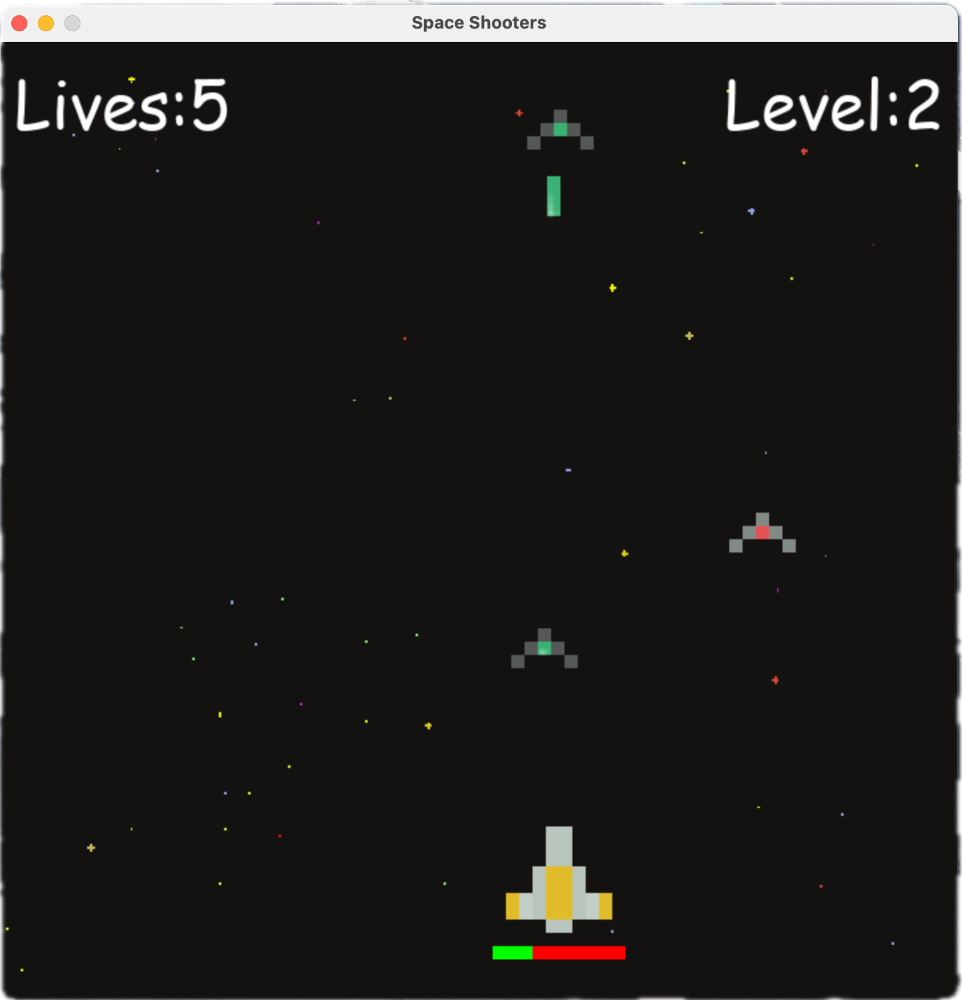
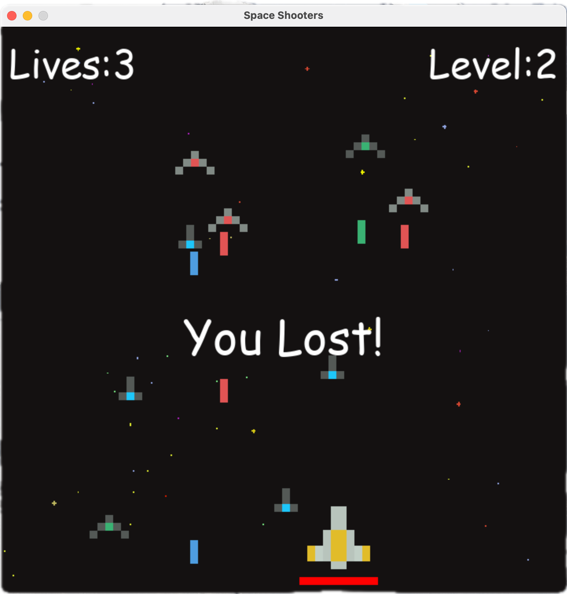

# Space Invaders
This is a side project of mine. It is a my version if the famous space invadors arcade game. 
## Getting Started
These instructions will get you a copy of the project up and running on your local machine for development and testing purposes. See deployment for notes on how to deploy the project on a live system.
### Prerequisites
What things you need to install the software and how to install them
1. Prepare an IDE
2. Install Python 3.10 or higher(go to:https://www.python.org/downloads/)
3. install Pygame(for mac, type this in terminal and run: pip3 install pygame)
### Running and testing
once you have every thing working and the source code cloned on your local machine, when you run it, you willl be redirected to a separate screen that pops up and displayes the game. 

